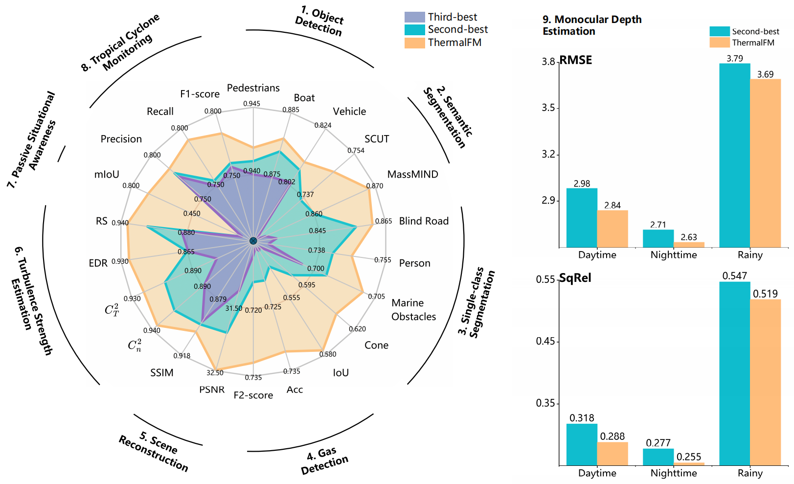

# 💡The repository for “Physics-collaborated Foundation Model for Thermal Infrared Imaging”

# 🔨**Installation**

Create a conda environment, activate the environment and install requirements:

```
conda create --name thermalFM python=3.9 -y
conda activate thermalFM
pip install -r requirements.txt
```

# 🚪Quick **Usage**

You can just download the weight in [https://drive.google.com/drive/folders/1hWhRLdBcqThV-UetAuCpbRxKXlzk5de3?usp=drive_link](https://drive.google.com/drive/folders/1hWhRLdBcqThV-UetAuCpbRxKXlzk5de3?usp=drive_link), then change the path in /Pre-train/ThermalFM before using ThermalFM as the encoder. 

# 📝Downstream tasks



**ALL the labels and the weights can be downloaded in https://pan.baidu.com/s/1vLIbBIZE22U009sHl2zS5g code: 89xy**

## Detection

1️⃣ Download the YOLO11 code

2️⃣ Put the model located in ./Detection/model/* to ultralytics-yolo11-main/ultralytics/nn/backbone/

3️⃣ Modify the ultralytics-yolo11-main/ultralytics/nn/tasks.py

4️⃣ Download the images in *Citations.md/Detection* and labels&weights in the link

5️⃣ Run the detect_*_myswin.py

## Single-class segmentation

1️⃣ Download the mmsegmentation

2️⃣ Put the model located in ./Single-Class Segmentation/* to mmsegmentation/

3️⃣ Modify the `__init__.py` in mmsegmentation/

4️⃣ Download the images in *Citations.md/Single-Class Segmentation* and labels&weights in the link

5️⃣ Run the inference of mmsegmentation

## Semantic segmentation

1️⃣ Download the mmsegmentation

2️⃣ Put the model located in ./Semantic Segmentation/* to mmsegmentation/

3️⃣ Modify the __init__.py in mmsegmentation/

4️⃣ Download the images in *Citations.md/Semantic Segmentation* and labels&weights in the link

5️⃣ Run the inference of mmsegmentation

## Monocular depth estimation

1️⃣ Download the code in https://github.com/UkcheolShin/SupDepth4Thermal

2️⃣ Put the model located in ./MonoSupDepth/* to SupDepth4Thermal/ follow the origin structure

3️⃣ Download the images in *Citations.md/MonoSupDepth* and weights in the link

4️⃣ Run the inference of SupDepth4Thermal
```
python test_monodepth.py --config ./configs/MonoSupDepth/<target_model>.yaml --ckpt_path "PATH for WEIGHT" --test_env test_day  --save_dir ./results/<target_model>/thr_day --modality thr
```
## Turbulence reconstruction and estimation

1️⃣ Download the code in https://codeocean.com/capsule/8596019/tree/v1

2️⃣ Put the model located in ./Turbulence/* to code/ follow the origin structure

3️⃣ Download the images in *Citations.md/Turbulence* and weights in the link

4️⃣ Run the inference of PBCL
```
python test.py
```
## Gas detection

1️⃣ Download the mmsegmentation

2️⃣ Put the model located in ./gas/* to mmsegmentation/

3️⃣ Modify the __init__.py in mmsegmentation/

4️⃣ Download the images in *Citations.md/gas* and weights in the link

5️⃣ Run the inference of mmsegmentation

## Tropical cyclone intensity

1️⃣ Download the images and weights in the link

2️⃣ Run the inference of Typhoon classification
```
python train_maed.py
```
3️⃣ Run the inference of Typhoon estimation
```
python test.py
```
4️⃣ Then smooth the result followed the origin methods by run 
```
python smooth.py
```
## Passive awareness

1️⃣ Download the code and data in https://github.com/FanglinBao/HADAR/blob/main/TeXNet

2️⃣ Download the weight in the link

3️⃣ Run the eval in the **main_mask2former.py**

# 🔗Citation
If you find our work useful, please cite us by the github address.
